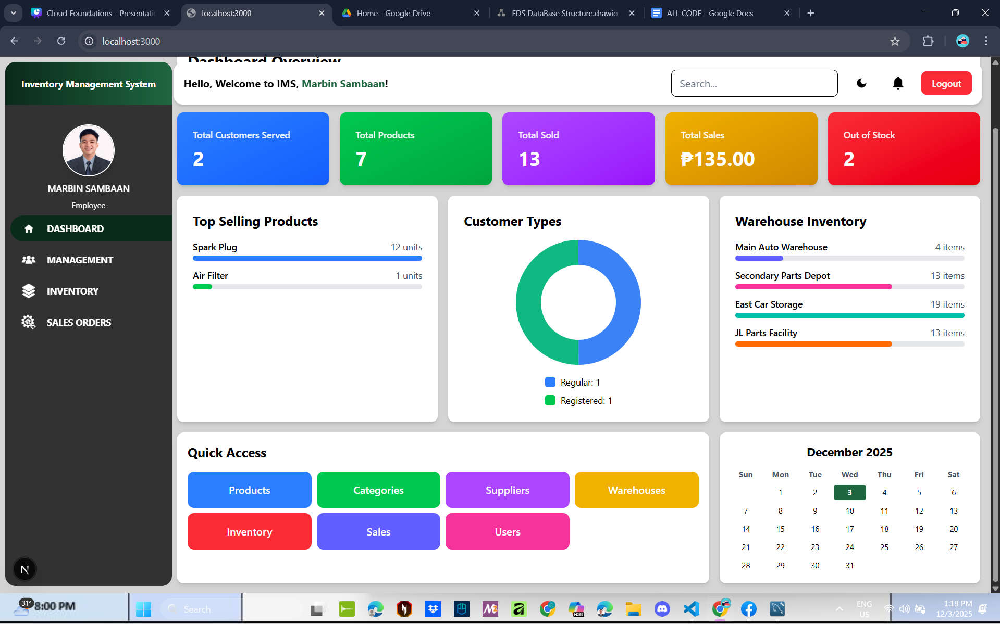
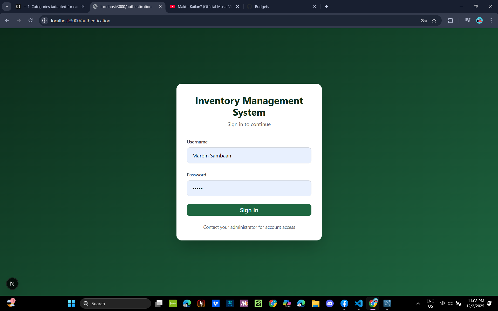
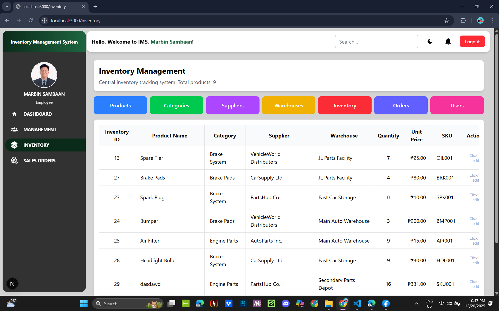
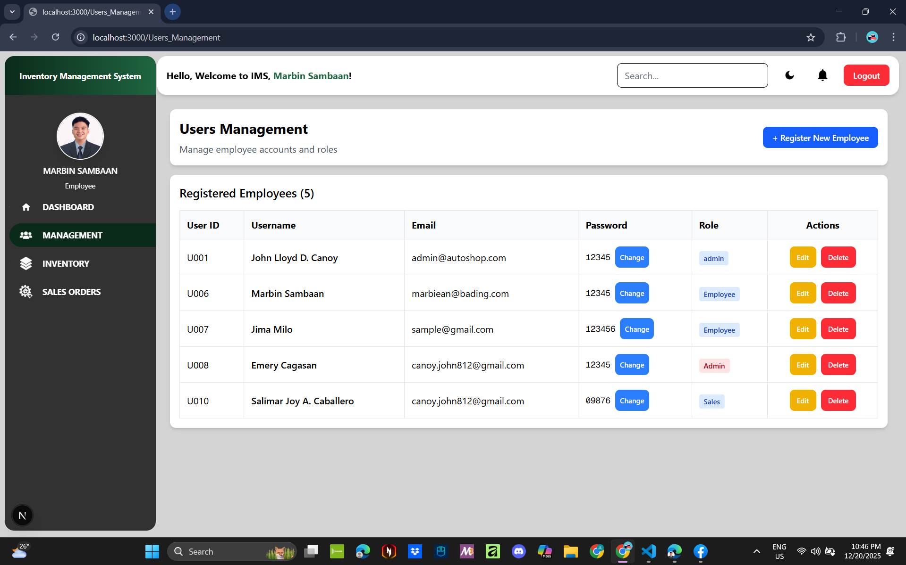

# 📦 Inventory Management System

A comprehensive full-stack inventory management solution built with Django REST Framework and Next.js, designed to streamline warehouse operations, track products, manage suppliers, and process orders efficiently.



## ✨ Features

### 🔐 Authentication & Authorization
- Secure user authentication with role-based access control
- Multi-user support with customizable permissions
- Session management and secure login/logout

### 📊 Inventory Management
- **Product Management**: Add, edit, delete, and track products with detailed information
- **Category Organization**: Organize products into categories for easy navigation
- **Stock Tracking**: Real-time inventory levels across multiple warehouses
- **Low Stock Alerts**: Automated notifications for products below threshold

### 🏢 Warehouse Management
- Multiple warehouse support
- Warehouse-specific inventory tracking
- Transfer products between warehouses
- Location-based stock allocation

### 🤝 Supplier Management
- Maintain comprehensive supplier database
- Track supplier contact information
- Link products to suppliers
- Supplier performance tracking

### 📋 Order Management
- Create and manage purchase orders
- Order status tracking (Pending, Processing, Completed, Cancelled)
- Order items with quantity and pricing
- Customer information management

### 💰 Sales Management
- Record sales transactions
- Generate sales reports
- Track revenue and sales history
- Customer purchase history

### 👥 User Management
- Admin dashboard for user administration
- Create, edit, and manage user accounts
- Assign roles and permissions
- User activity tracking

## 🛠️ Tech Stack

### Backend
- **Framework**: Django 4.x
- **API**: Django REST Framework
- **Database**: SQLite (Development) / PostgreSQL (Production recommended)
- **Language**: Python 3.x

### Frontend
- **Framework**: Next.js 14+ (App Router)
- **Language**: TypeScript
- **Styling**: Tailwind CSS
- **UI Components**: Custom components with shadcn/ui
- **State Management**: React Hooks

## 📁 Project Structure

```
Inventory Management System/
├── back-end/
│   └── myBackend/
│       ├── manage.py
│       ├── myapp/              # Main Django app
│       │   ├── models.py       # Database models
│       │   ├── views.py        # API views
│       │   ├── urls.py         # App routes
│       │   └── migrations/     # Database migrations
│       └── myBackend/          # Project settings
│           ├── settings.py     # Django configuration
│           └── urls.py         # Main URL routing
│
├── front-end/
│   └── inventory-front-end/
│       ├── app/
│       │   ├── authentication/ # Login/Auth pages
│       │   ├── inventory/      # Inventory modules
│       │   │   ├── products/
│       │   │   ├── categories/
│       │   │   ├── warehouses/
│       │   │   ├── Supplier/
│       │   │   ├── Orders/
│       │   │   └── OrderItems/
│       │   ├── Sale/           # Sales management
│       │   └── Users_Management/
│       ├── components/         # Reusable components
│       └── lib/                # Utilities and API client
│
└── database/                   # SQL migration scripts
    ├── add_customer_name_column.sql
    ├── add_subtotal_column.sql
    └── add_timestamps.sql
```

## 🚀 Getting Started

### Prerequisites

- **Python** 3.8 or higher
- **Node.js** 18.x or higher
- **npm** or **yarn**
- **Git**

### Backend Setup

1. **Navigate to the backend directory**
   ```bash
   cd back-end/myBackend
   ```

2. **Create a virtual environment**
   ```bash
   python -m venv venv
   ```

3. **Activate the virtual environment**
   - Windows:
     ```bash
     venv\Scripts\activate
     ```
   - macOS/Linux:
     ```bash
     source venv/bin/activate
     ```

4. **Install dependencies**
   ```bash
   pip install django djangorestframework django-cors-headers
   ```

5. **Run migrations**
   ```bash
   python manage.py migrate
   ```

6. **Create a superuser**
   ```bash
   python manage.py createsuperuser
   ```

7. **Start the development server**
   ```bash
   python manage.py runserver
   ```
   
   Backend will be available at `http://localhost:8000`

### Frontend Setup

1. **Navigate to the frontend directory**
   ```bash
   cd front-end/inventory-front-end
   ```

2. **Install dependencies**
   ```bash
   npm install
   ```

3. **Create environment file**
   ```bash
   # Create .env.local
   NEXT_PUBLIC_API_URL=http://localhost:8000
   ```

4. **Start the development server**
   ```bash
   npm run dev
   ```
   
   Frontend will be available at `http://localhost:3000`

## 📸 Screenshots

### LOG IN



### Dashboard

*Main dashboard with inventory overview and quick stats*

### Product Management

*Manage products with search, filter, and CRUD operations*


### Warehouse View

*Multi-warehouse inventory tracking*

### Sales Interface

*Record and track sales transactions*

### USERS MANAGEMENT


## 🔌 API Endpoints

### Authentication
- `POST /api/auth/login/` - User login
- `POST /api/auth/logout/` - User logout

### Products
- `GET /api/products/` - List all products
- `POST /api/products/` - Create new product
- `GET /api/products/{id}/` - Get product details
- `PUT /api/products/{id}/` - Update product
- `DELETE /api/products/{id}/` - Delete product

### Categories
- `GET /api/categories/` - List categories
- `POST /api/categories/` - Create category

### Warehouses
- `GET /api/warehouses/` - List warehouses
- `POST /api/warehouses/` - Create warehouse

### Orders
- `GET /api/orders/` - List orders
- `POST /api/orders/` - Create order
- `PUT /api/orders/{id}/` - Update order status

### Sales
- `GET /api/sales/` - List sales
- `POST /api/sales/` - Record new sale

### Users
- `GET /api/users/` - List users (Admin only)
- `POST /api/users/` - Create user (Admin only)

## 🔧 Configuration

### Backend Configuration
Edit `back-end/myBackend/myBackend/settings.py`:
- Database settings
- CORS allowed origins
- Secret key
- Debug mode

### Frontend Configuration
Edit `front-end/inventory-front-end/.env.local`:
- API endpoint URL
- Environment variables

## 🌐 Deployment

### Backend Deployment (Example with Railway/Heroku)
1. Set up PostgreSQL database
2. Configure environment variables
3. Run migrations
4. Collect static files: `python manage.py collectstatic`
5. Deploy with your preferred platform

### Frontend Deployment (Vercel)
1. Connect your GitHub repository
2. Configure build settings
3. Set environment variables
4. Deploy

## 📝 Usage

1. **Login**: Access the system through the authentication page
2. **Dashboard**: View inventory summary and quick actions
3. **Manage Products**: Add, edit, or remove products from inventory
4. **Process Orders**: Create and track purchase orders
5. **Record Sales**: Log sales transactions and generate reports
6. **Manage Users**: Admin users can create and manage user accounts

## 🤝 Contributing

Contributions are welcome! Please follow these steps:

1. Fork the repository
2. Create a feature branch (`git checkout -b feature/AmazingFeature`)
3. Commit your changes (`git commit -m 'Add some AmazingFeature'`)
4. Push to the branch (`git push origin feature/AmazingFeature`)
5. Open a Pull Request


